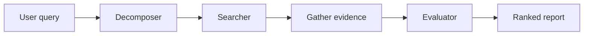

## SetScout

Finding the right public dataset means tab-hopping across Hugging Face, skimming READMEs, and mentally scoring fit against your constraints. **SetScout** automates that loop: describe what you need in plain language, and a four-node LangGraph pipeline searches sources, fetches evidence, and returns a structured markdown report with per-dataset requirement checks and rankings.



### Pipeline

1. **Decomposer** — turns form inputs into a `SearchSpec` (keywords, MeSH terms, sources, hard constraints). LLM with rule-based fallback.
2. **Searcher** — parallel async search across Hugging Face and Kaggle. Returns up to 8 candidates.
3. **Gather evidence** — fetches dataset cards and README excerpts in parallel.
4. **Evaluator** — single batch LLM call scores all candidates: requirement checks, known issues, fit summaries, and final ranking.

### Usage

```python
from setscout import run_pipeline

result = run_pipeline({
    "purpose": "benchmark sentiment classifiers",
    "domain": "natural language processing",
    "data_type": "text datasets",
    "requirements": "English, labeled, at least 1000 examples",
    "exclude_datasets": "IMDB",
})
print(result["report"])
```

**Required fields:** `purpose`, `domain`, `data_type`  
**Optional:** `requirements`, `additional_notes`, `exclude_datasets`

### Stack

LangGraph, LangChain, Pydantic, Gemini API. Optional Langfuse tracing and Kaggle credentials for extended search.

### Status

Active development. A Gradio UI and Hugging Face Spaces deployment are in progress; live demo coming soon.

---

<p align="left">
  <a href="https://github.com/5aumit/setscout" class="btn btn--primary">Explore the Repository</a>
  <a href="https://deepwiki.com/5aumit/setscout" class="btn btn--info">Read the Docs</a>
</p>
